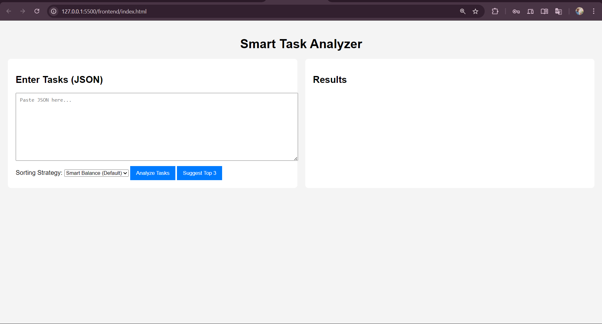
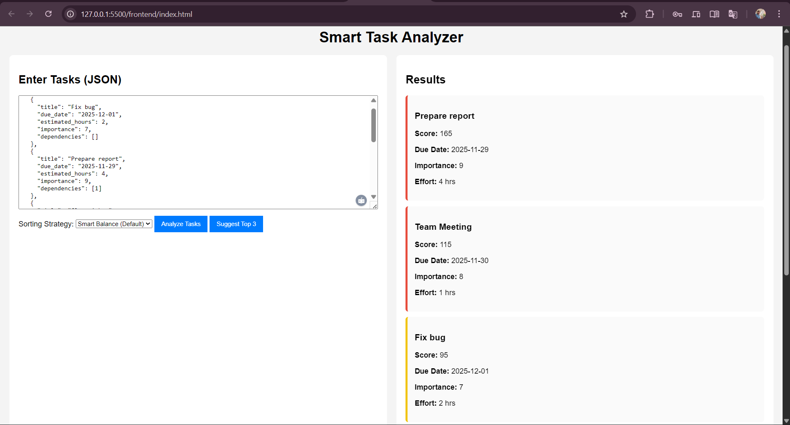
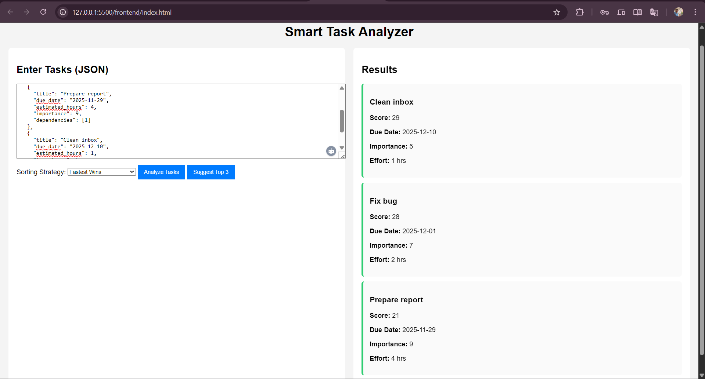
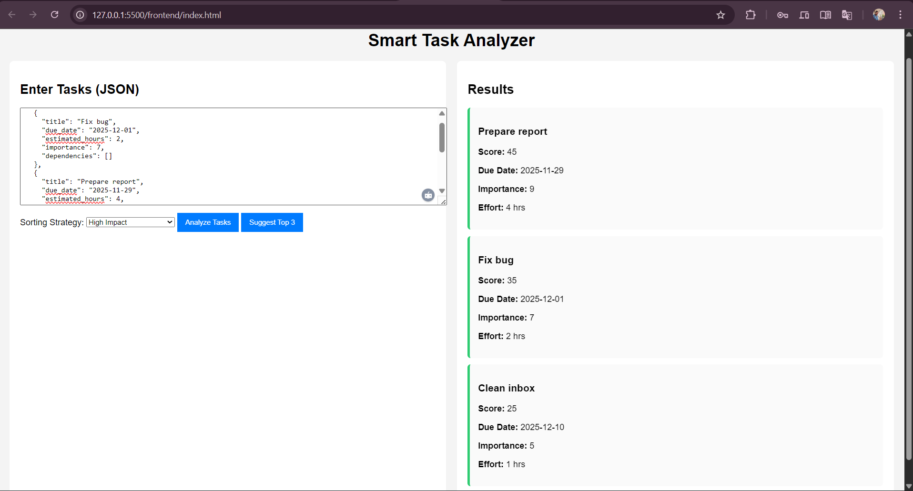
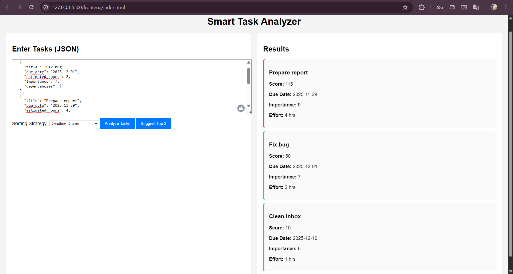
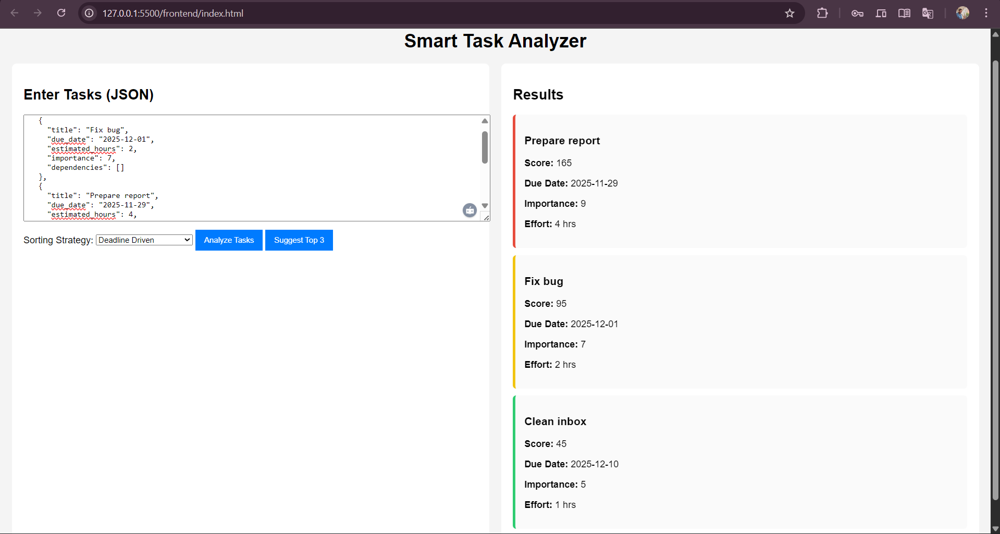
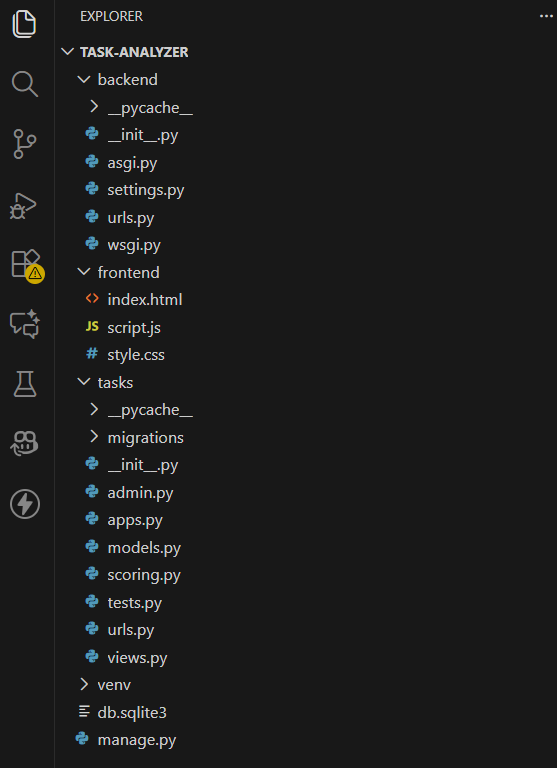
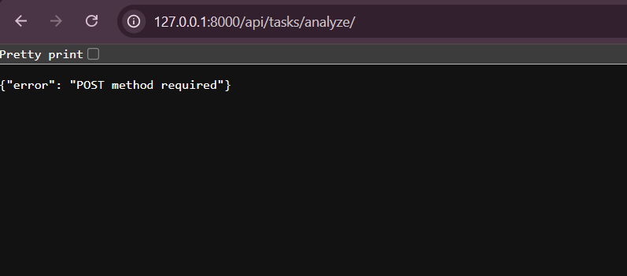
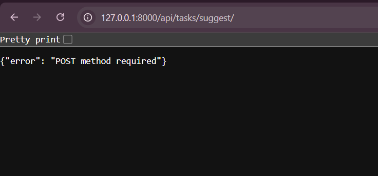

Smart Task Optimization & Intelligence System (STOIS)

A lightweight AI-powered task-ranking engine built using Django + JavaScript, created as part of the Singularium Internship Technical Assignment 2025.

This system analyzes tasks, scores them based on urgency, importance, effort, dependencies, and provides intelligent suggestions using multiple strategies — enhanced with date intelligence (weekends + holidays awareness).

🚀 Features
✅ Core Features

Intelligent task scoring using:

Urgency (days left + overdue penalty)

Importance weightage

Effort score (quick-wins detection)

Dependencies impact

Multiple sorting strategies:

Smart Balance (default)

Fastest Wins

High Impact

Deadline Driven

Suggest Top 3 button powered by backend scoring logic.

🧠 Bonus Feature: Date Intelligence

Boosts urgency automatically when:

Condition	Effect
Task is overdue	+100 urgency
Due date is in 2 days	+50 urgency
Due date falls on weekend	+15
Due date is a holiday	+25
Holidays used
2025-01-01
2025-01-14
2025-03-14
2025-10-02

🧪 Bonus Feature: Unit Tests

Includes automated tests for:

Urgency & overdue scoring

Quick task bonus

Strategy checks (impact > fast, etc.)

Run tests:

python manage.py test

📁 Project Structure
task-analyzer/
│── backend/
│   ├── backend/               # Django configuration
│   ├── tasks/                 # App: scoring, views, urls, tests
│── frontend/
│   ├── index.html
│   ├── script.js
│   ├── style.css
│── screenshots/               # All captured images
│── requirements.txt
│── README.md
│── manage.py

🖥️ Tech Stack
Layer	Technology
Backend	Django, Django REST Framework
Frontend	HTML, CSS, Vanilla JavaScript
Testing	Django TestCase
Extras	Date Intelligence Logic
🔧 Installation & Running
1️⃣ Clone the repository
git clone https://github.com/<your-username>/<repo-name>.git
cd task-analyzer

2️⃣ Create virtual environment
python -m venv venv
venv\Scripts\activate     # Windows

3️⃣ Install dependencies
pip install -r requirements.txt

4️⃣ Apply migrations
python manage.py migrate

5️⃣ Start backend
python manage.py runserver

Backend endpoints:

Analyze → http://127.0.0.1:8000/api/tasks/analyze/

Suggest → http://127.0.0.1:8000/api/tasks/suggest/

6️⃣ Open frontend

Open directly:

frontend/index.html

or using Live Server:

127.0.0.1:5500/frontend/index.html

🧩 Sample Input JSON

Paste this inside the textarea in your UI:

[
  {
    "title": "Fix bug",
    "due_date": "2025-12-01",
    "estimated_hours": 2,
    "importance": 7,
    "dependencies": []
  },
  {
    "title": "Prepare report",
    "due_date": "2025-11-29",
    "estimated_hours": 4,
    "importance": 9,
    "dependencies": [1]
  },
  {
    "title": "Clean inbox",
    "due_date": "2025-12-10",
    "estimated_hours": 1,
    "importance": 5,
    "dependencies": []
  }
]

This demonstrates differences between Smart, Fast, Impact, and Deadline strategies clearly.

🖼️ Screenshots

### 🔍 Application UI

### 📊 Smart Strategy Output

### ⚡ Fastest Wins Results

### 🎯 High Impact Results

### ⏳ Deadline Driven Results

### 🥇 Top 3 Suggestions Results

### 📂 Project Folder Structure

### 🧪 Tests Passed
.png)

### 🔍 Analyze Endpoint

### 🤖 Suggest Endpoint

🏁 Conclusion

STOIS is a fully functional task intelligence engine capable of ranking, scoring, and suggesting tasks using custom heuristics, boosted with holiday/weekend awareness and tested using Django’s unit testing system."# STOIS-Smart_Task_Optimization_and_Intelligence_System" 
